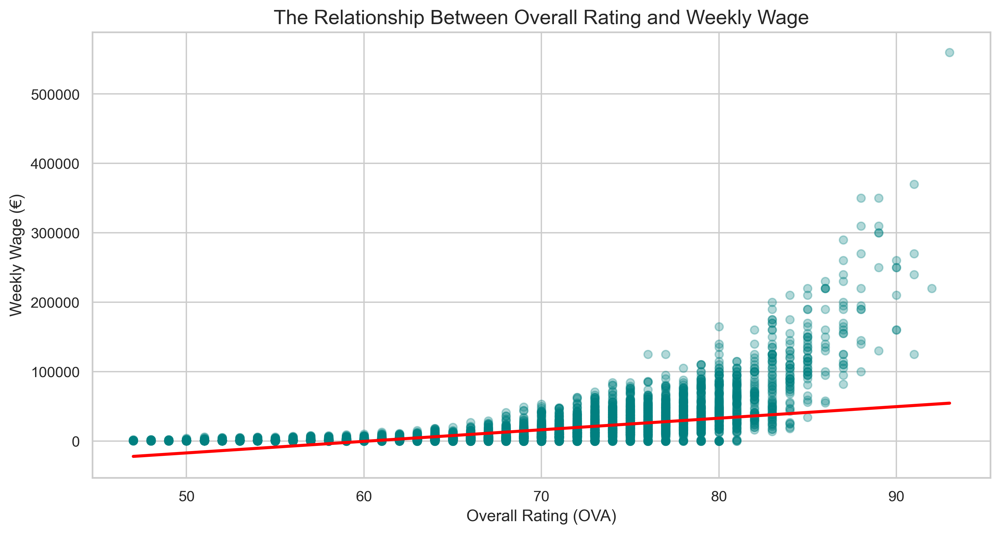
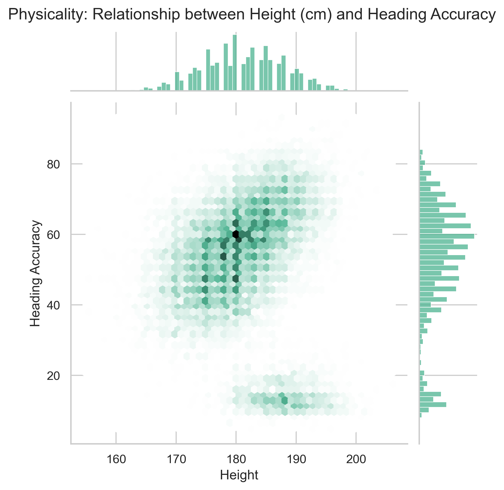
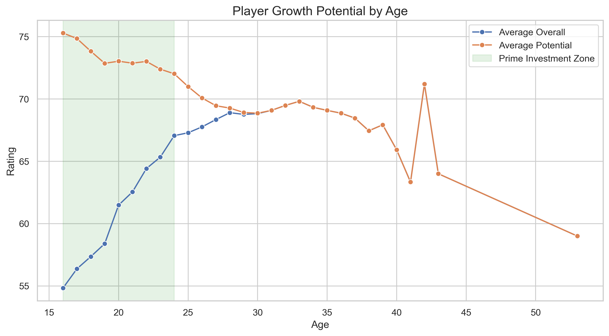
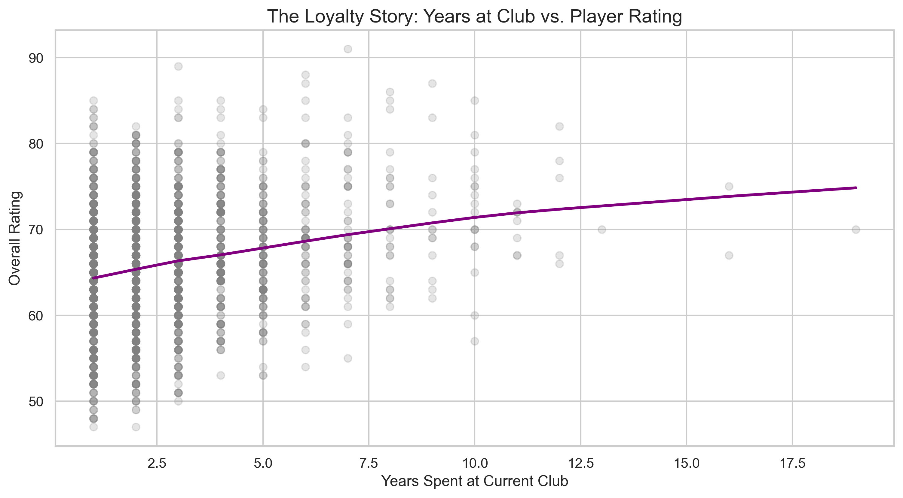
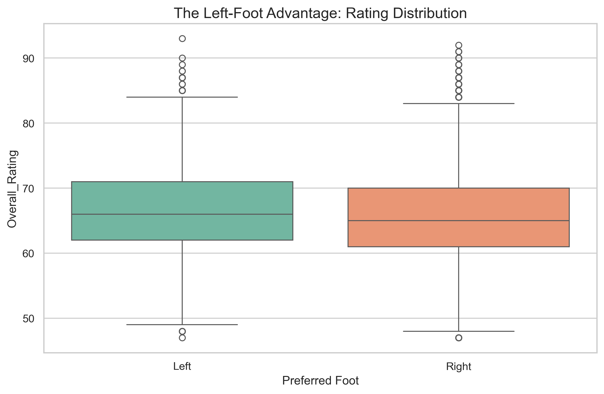
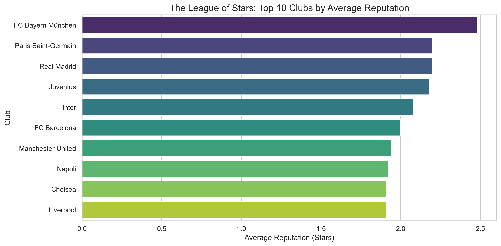

# FIFA 21 Data Cleaning & Strategic Analytics ⚽📊

## Project Overview
This project involves an end-to-end data engineering and analytics pipeline using the FIFA 21 dataset (18,979 players). The primary objective was to transform a highly "dirty" dataset—characterized by inconsistent units, special characters, and structural noise into a high-integrity analytical asset. 

Beyond cleaning, the project explores the strategic economics of football, identifying trends in player value, development windows, and organizational brand power.

## 🛠️ The Data Cleaning Pipeline
Raw data is rarely ready for a business report. This project tackled several complex cleaning hurdles using **Python** and **Pandas**:

### 1. Physical Attribute Standardization
* **The Challenge:** `Height` and `Weight` were stored as objects with mixed units (e.g., `6'0"`, `175cm`, `185lbs`, `70kg`).
* **The Solution:** I engineered custom parsing functions to standardize all entries into **Centimeters (cm)** and **Kilograms (kg)**.

### 2. Financial Engineering & Currency Conversion
* **The Challenge:** `Value`, `Wage`, and `Release Clause` contained currency symbols (€) and text suffixes (M, K).
* **The Solution:** Developed a robust logic to strip symbols and multiply values by their respective magnitudes, converting them into **numeric floats**.

### 3. Sanitization of Categorical & Special Data
* **Star Ratings:** Stripped the "★" symbol from `Weak_Foot`, `Skill_Moves`, and `International_Reputation`.
* **Structural Noise:** Removed hidden newline characters (`\n`) from the `Club` column.
* **Integrity Checks:** Handled the `Hits` column by parsing "K" values and filling null entries with `0`.

### 4. Datetime & Feature Engineering
* **Joined Date:** Converted the `Joined` column into **Datetime** objects.
* **Tenure Metric:** Created a new feature, `Years_at_Club`, to analyze player loyalty.

## 📈 Strategic Insights & Data Storytelling

### I. The Money Story (Rating vs. Wage)
Analysis identified that wages follow an **exponential growth curve**. While player compensation remains relatively flat for ratings 50–80, "Elite" players (85+) command a massive market premium.

### II. The Physicality Story (Height vs. Heading Accuracy)
A hexbin jointplot revealed a strong correlation between stature and heading accuracy. Notably, the data isolated a "Goalkeeper Cluster"—tall players with near-zero heading accuracy.

### III. The Investment Window (Age vs. Potential)
By visualizing the gap between a player's current rating and their potential, I identified the **Return on Investment (ROI) Zone** between **ages 16 and 23**.

### IV. The Loyalty Story (Years at Club vs. Rating)
The data reveals a "Selection Bias" in loyalty. Long-tenure players (10+ years) consistently hold higher average ratings, proving that only high-performers survive at a club long-term.

### V. The "Left-Foot" Advantage
Boxplot analysis revealed that left-footed players have a **higher median Overall_Rating** than right-footed players, suggesting a higher "quality floor" for these specialists.

### VI. The League of Stars (Organizational Brand Power)
Identified the "Heavyweights" of football. **FC Bayern München**, **PSG**, and **Real Madrid** lead the world in "Star Density," showcasing recruitment strategies focused on global prestige.

### VII. The Protection Gap (Value vs. Release Clause)
Clubs set release clauses significantly higher than market value—often by **20% to 50%**—to act as a financial deterrent against rival acquisitions.

## 💻 Technologies Used
* **Language:** Python 3.x
* **Data Wrangling:** Pandas, NumPy
* **Visualization:** Seaborn, Matplotlib
* **Environment:** Jupyter Notebook

## 🏁 Conclusion
This project demonstrates that the most valuable insights are hidden behind the messiest columns. By moving beyond basic cleaning and into strategic feature engineering, I was able to quantify the financial and developmental patterns that govern professional football.

**Author:** Saviour Amegayie  
**Date:** February 2026  
**License:** MIT
